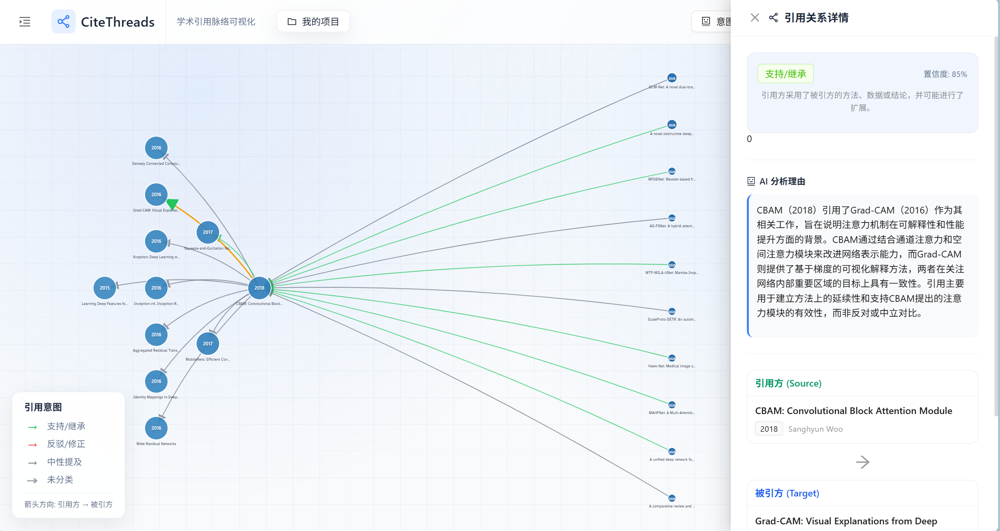
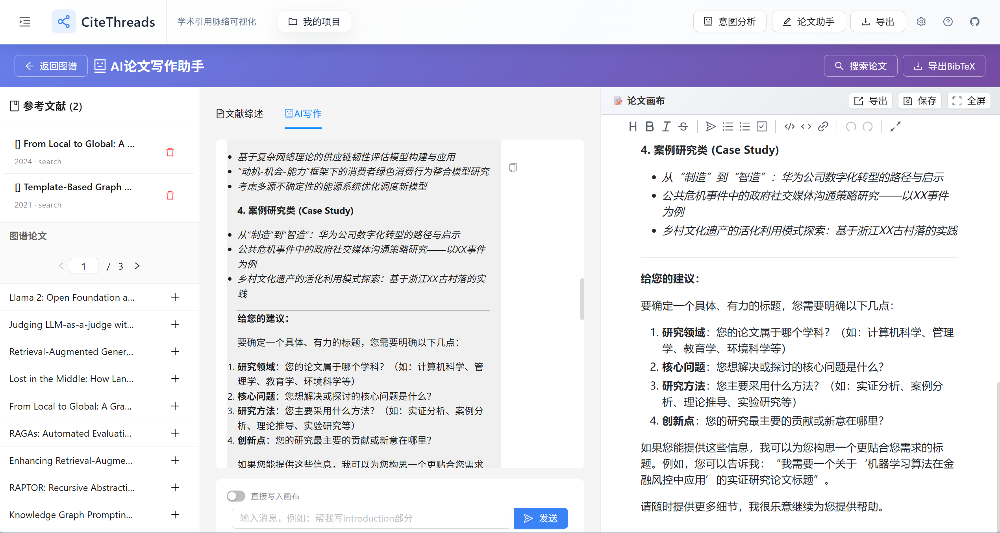

# 引脉 (CiteThreads) - 学术引用脉络可视化与智能写作助手

[](https://github.com/anthony/CiteThreads)   

> **深入探索文献关系，无缝辅助学术写作**
>
> **引脉 (CiteThreads)** 是一个集成了学术引用图谱构建、多源文献聚合搜索与 AI 辅助写作的综合性研究工具。它帮助研究人员快速厘清领域内的引用脉络，发现核心文献，并在沉浸式的环境中高效完成论文撰写。
>
> 

---

[**中文**](./README.md) | [**English**](./README_EN.md)

## ✨ 核心功能 (Core Features)

### 1. 🔍 深度引用图谱构建 (Visual Knowledge Graph)
CiteThreads 全自动爬取并整合 **OpenAlex**, **Semantic Scholar**, **ArXiv** 等多源数据，为您构建清晰的文献引用网络。

- **多层级穿透**：支持设置引用深度，自动发现"文献的文献"。
- **智能筛选**：自动过滤高影响力论文，识别引用意图（支持/反驳/提及）。
- **可视化交互**：基于 D3.js/PixiJS 的高性能图谱，支持缩放、拖拽与节点详情查看。



### 2. 📝 沉浸式 AI 写作助手 (Immersive AI Writing Assistant)
集成了功能强大的 Markdown 编辑器与上下文感知的 AI 助手，让写作与思考同步进行。

- **全屏专注模式**：左侧 AI 辅助，右侧全屏写作，减少切换干扰。
- **图谱上下文感知**：AI 助手能够理解您当前构建的引文图谱，提供更有针对性的写作建议。
- **一键引用插入**：直接从图谱或搜索结果中将文献以标准格式插入文档。
- **所见即所得**：基于 Vditor 的专业级 Markdown 编辑体验。



### 3. 🌐 统一多源搜索 (Unified Multi-source Search)
打破数据源壁垒，一站式获取全网学术资源。

- **多源聚合**：同时搜索 OpenAlex, ArXiv, DBLP 等多个数据库。
- **智能 ID 解析**：自动识别 DOI, ArXiv ID, OpenAlex ID 等多种格式，实现精准跨库检索。
- **实时预览**：快速查看论文摘要、引用数与发表信息。


---

## 🛠️ 技术栈 (Tech Stack)

### Frontend
- **Framework**: React 18 + Vite
- **UI Library**: Ant Design 5
- **Visualization**: D3.js / React-Force-Graph
- **Editor**: Vditor (Markdown)
- **State Management**: MobX

### Backend
- **Framework**: FastAPI (Python 3.10+)
- **Crawlers**: 异步并发爬虫 (httpx + asyncio)
- **Data Sources**:
    - OpenAlex API
    - Semantic Scholar API
    - ArXiv API
    - CrossRef API
- **AI Integration**: LLM 接口支持 (DeepSeek/OpenAI 兼容)

---

## 🚀 快速开始 (Quick Start)

### 环境要求
- Node.js >= 16
- Python >= 3.10

### 1. 启动后端 (Backend)
```bash
cd backend
# 安装依赖
pip install -r requirements.txt
# 启动服务
python -m uvicorn app.main:app --host 0.0.0.0 --port 8000 --reload
```

### 2. 启动前端 (Frontend)
```bash
cd frontend
# 安装依赖
npm install
# 启动开发服务器
npm run dev
```

访问 `http://localhost:5173` 即可开始使用。

---

## 📄 License
This project is licensed under the MIT License.
