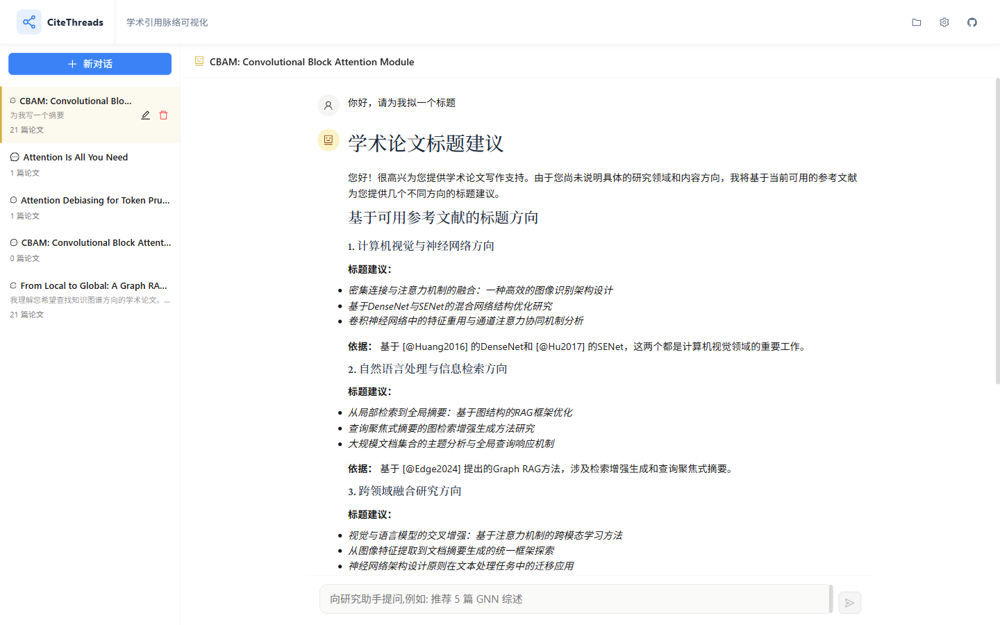
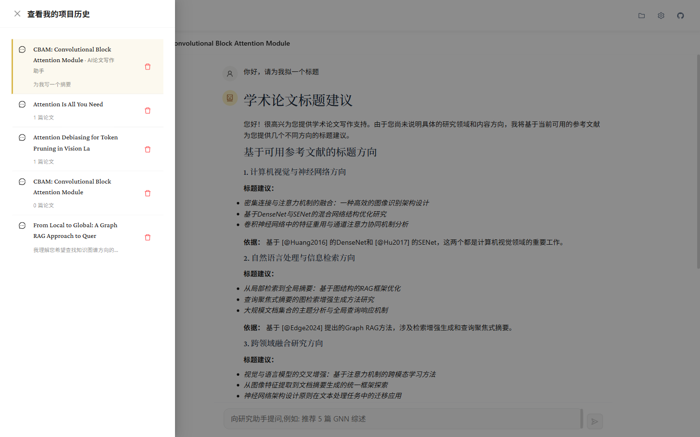

# CiteThreads - Academic Research & Writing Assistant

[](https://github.com/NkAntony777/CiteThreads)    

> **Deep-dive literature relationships, seamless academic writing**
>
> **CiteThreads** is a focused research assistant built around two things: top-tier paper search and top-tier paper writing. Users type a sentence in a ChatGPT-style dialog; the agent automatically searches multi-source papers, snowballs when needed, triggers the long-form pipeline on demand, and produces inline `[@AuthorYear]` citations automatically.



---

[**中文**](./README.md) | [**English**](./README_EN.md)

## ✨ Core Features

### 1. 🤖 ChatGPT-style Entry Point
The entire app is one conversation window. Left sider: conversation list. Center: scrollable message thread + bottom input bar.

- **Natural language input**: "Write me a GNN survey", "Recommend 5 Transformer papers", "Find citations of X" — the agent figures out the intent
- **Multi-conversation history**: each project = one conversation; hit "+ New chat" to start fresh
- **Persistence**: every message saved to `Project.chat_history`; refresh restores the full thread



### 2. 🔍 Agentic Search + Snowball
7 tools built in (multi-source + citation graph + project-aware). The agent decides which to call:

- **`search_papers`**: cross-source search across OpenAlex / arXiv / DBLP / PubMed
- **`get_citing_papers`** / **`get_referenced_papers`**: snowball from an anchor paper
- **`search_by_author`**: find papers by author name
- **`get_paper_details`**: full metadata for one paper
- **`list_project_references`**: list the project's already-cited papers, so the agent avoids duplicates
- **`find_research_gaps`**: surface open questions from the project's citation graph

**Zero-hit escalation**: when every search returns empty, the agent automatically switches to `search_by_author` or snowball expansion. **Search results are streamed to the client the moment a tool returns** — the panel never goes empty even if the run later hits the iteration cap.

### 3. 📝 Long-form Pipeline (CTDP)
When the user expresses a "write me a paper / survey / ... " intent, the agent **implicitly** triggers the 5-phase pipeline (or you can run phases explicitly from the embedded progress panel in ChatView):

| Phase | Role | Output |
|---|---|---|
| 1. Research | Scout + Scribe | Candidate papers + summaries + research gaps |
| 2. Structure | Architect + Formatter | Section outline + styled outline |
| 3. Compose | Crafter + Refiner | introduction / literature_review / methodology / results / discussion / conclusion |
| 4. Validate | Referee + FactCheck | QA report |
| 5. Compile | Compiler + Abstract | Final paper .md / .pdf / .docx / .tex |

**Progress cards + resume + retry** (embedded in ChatView — **never leaves the conversation**):
- 5 phase cards with live status (pending / running / ✓ done / ✗ failed / ⊘ skipped)
- Compose card expands to show its 6 sub-section progress
- Failed cards have a prominent **Retry** button
- Backend auto-detects existing checkpoints and routes through `runner.resume_from()` — already-written sections are preserved
- QualityGate scores the draft on 5 axes (word_count / citation_density / completeness / structure / graph_health) and appends to `quality_history`

### 4. 🌐 Automatic Citation
Every paper suggestion in chat carries `[@AuthorYear]` style citations. The long-form writer embeds them inline. Exports are produced by `backend/app/services/draft_pipeline/exporters.py`:
- Markdown (`.md`)
- PDF (`.pdf`, rendered by WeasyPrint from HTML+CSS)
- DOCX (`.docx`, built with python-docx)
- LaTeX source (`.tex`, ready to paste into a `\documentclass{article}` project)

### 5. ⚙️ AI Settings Panel
Click the gear icon in the top-right → **AI Settings**:


- **Provider**: SiliconFlow / OpenAI / DeepSeek / Anthropic / Google / Custom
- **Model**: provider-specific model name
- **API Key**: leave blank to use the server's `SILICONFLOW_API_KEY` env var (recommended for dev)
- **Temperature / Max Tokens / System Prompt**: tunable
- Config persists in `localStorage` and is **injected to the backend via the `X-AI-Config` request header**

### 6. 🌍 Multi-language
Real-time switching between Chinese and English. i18n via i18next + react-i18next + Ant Design `LocaleProvider`; preference persisted to `localStorage`; **Ant Design component strings switch in lockstep**.

---

## 🛠 Tech Stack

### Frontend
- **Framework**: React 18 + Vite + TypeScript
- **UI Library**: Ant Design 5
- **State Management**: Zustand
- **Internationalization**: i18next + react-i18next + Ant Design `LocaleProvider`
- **Markdown**: react-markdown
- **Visualization**: D3.js (graph canvas) + dagre
- **Editor**: Vditor (CanvasEditor)
- **Layout**: react-resizable-panels
- **Tests**: Vitest + Testing Library

### Backend
- **Framework**: FastAPI (Python 3.10+) + Pydantic v2
- **Auth**: Bearer Token (`app/auth.py`, applied at the app level)
- **Logging**: structured JSON (`app/logging_config.py`)
- **Observability**: Prometheus `/metrics` + JSON `/api/metrics`
- **Health**: `/health`, `/health/live`, `/health/ready`
- **Agent Runtime**: OpenAI-compatible tool-calling loop (`AgentRuntime` in `agent_runtime/runtime.py`, 7 tools)
- **CTDP Draft Pipeline**: 5 phases (research / structure / compose / validate / compile) + 5-axis QualityGate
- **Crawlers**: OpenAlex / Semantic Scholar / ArXiv / CrossRef / DBLP / PubMed
- **Storage**: JSON-file based (`data/projects/<project_id>/`, includes `chat_history.json` and `draft_state.json`)
- **LLM Factory**: `app/services/llm_factory.py` wrapping `AsyncOpenAI`
- **Exporters**: WeasyPrint (PDF) / python-docx (DOCX) / LaTeX renderer
- **AI Integration**: SiliconFlow / DeepSeek / OpenAI / Anthropic / Google / Custom

---

## 🚀 Quick Start

### Prerequisites
- Node.js >= 16
- Python >= 3.10

### 1. Backend
```bash
cd backend
python -m venv .venv
.\.venv\Scripts\python.exe -m pip install -r requirements.txt
.\.venv\Scripts\python.exe -m uvicorn app.main:app --host 0.0.0.0 --port 8000 --reload
```

### 2. Frontend
```bash
cd frontend
npm install
npm run dev
# Open http://localhost:5173
```

### 3. Configure the LLM (optional)
After the UI loads, click the gear icon → **AI Settings** (see section 5 above). If the server is already configured with `SILICONFLOW_API_KEY`, you can simply **leave the API Key blank**.

### 4. Get Started
- Hit [+ New chat] to start a fresh conversation
- Type naturally, e.g. "Help me write a survey on graph neural networks"
- The agent will search, write, and cite automatically
- Switch to a past conversation from the history drawer to continue

---

## 📁 Project Structure

```
backend/app/
  main.py               # FastAPI entry + router mount + CORS + middleware
  config.py             # pydantic-settings
  auth.py               # Bearer Token auth
  logging_config.py     # JSON logging
  metrics.py            # Prometheus metrics
  health.py             # /health combined + liveness/readiness
  cost_guard.py         # LLM cost guardrails
  rate_limit.py         # Rate limiting
  users.py              # User table (for auth)
  agent_runtime/        # Tool-calling agent (AgentRuntime + 7 tools + session memory)
  crawlers/             # 6 academic database crawlers (OpenAlex / S2 / arXiv / DBLP / PubMed / Crossref)
  routers/              # papers / projects / writing / ai / agent / draft / admin
  services/
    llm_factory.py      # Unified AsyncOpenAI client
    paper_search_service.py
    storage.py          # JSON-file project storage
    cache.py            # Result cache
    network_analysis.py # Citation graph analysis
    gap_detection.py    # Research gap discovery
    draft_pipeline/     # CTDP: 5 phases + QualityGate + checkpoints + exporters
  models/               # Pydantic schemas

frontend/src/
  App.tsx               # Top-level shell (Header + ChatView + drawers)
  main.tsx              # Entry
  i18n.ts               # i18next config
  components/
    ChatView/           # Main conversation window (sider + thread + input + PhaseProgressPanel)
    AISettings/         # AI config panel (provider / model / key / temperature)
    HistoryPanel/       # Past-conversations drawer
    AgentChatPanel/     # (legacy) standalone chat panel
    DraftGenerator/     # (legacy) CTDP trigger
    SearchBar/          # (legacy) SmartSearch entry
    GraphCanvas/        # D3 graph (kept for legacy projects)
    WritingAssistant/   # Vditor editor
    LiquidBackground/   # Glassy liquid background
  stores/               # graphStore / filterStore / uiStore
  services/             # api / chatApi / draftApi / agentStream / writingApi / aiConfig
  hooks/                # useChatStream etc.
  locales/              # zh-CN.json + en-US.json
  types/                # Shared TypeScript types
  utils/                # Utility functions + graph layouts

backend/tests/                    # Pytest (CTDP phase unit tests + draft router integration)
frontend/src/**/*.test.tsx         # Vitest
```

---

## 🧪 Tests

```bash
# Backend
cd backend
.\.venv\Scripts\python.exe -m pytest tests/ -q

# Frontend
cd frontend
npm run test:run
npx tsc --noEmit
npm run lint
```

---

## 📜 License
MIT
